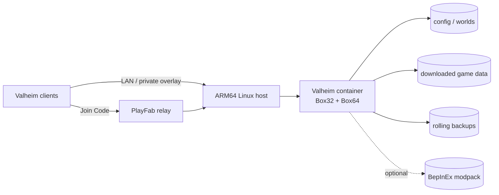

<div align="center">

# Valheim ARM64 Dedicated Server

Production-minded Docker Compose deployment for a Valheim dedicated server on
64-bit ARM Linux.


[Installation](docs/INSTALLATION.md) ·
[Configuration](docs/CONFIGURATION.md) ·
[Operations](docs/OPERATIONS.md) ·
[Mods](docs/MODS.md) ·
[Upstream maintenance](docs/UPSTREAM.md)

</div>

> [!IMPORTANT]
> The verified configuration is a Raspberry Pi 4 running Raspberry Pi OS Lite
> 64-bit with `ARM64_DEVICE=rpi4`. Other Linux ARM64 devices use the same stack
> through a selectable Box64 profile, but have not been tested by this project.

> [!IMPORTANT]
> If you run into a problem, please [open an Issue](https://github.com/AlexZha-dev/valheim-arm64-dedicated-server/issues)
> with your host model, operating-system version, selected `ARM64_DEVICE`
> profile, relevant Compose output and a sanitized log excerpt. Never include
> passwords, tokens, private IP addresses or world files.

Valheim and SteamCMD ship x86 Linux binaries. This image runs SteamCMD through
Box32 and the dedicated server through Box64, while keeping worlds, game files,
backups and optional mods in persistent host directories.

## Highlights

- Crossplay with a Join Code by default; LAN and private-overlay modes remain available.
- Reproducible image inputs pinned by digest.
- Graceful shutdown and persistent world storage.
- Hourly rolling world archives with age and count retention.
- Verified manual backups for worlds, access lists and optional mods.
- Administrator, difficulty and world-modifier settings through `.env`.
- Optional, isolated BepInEx workflow; vanilla remains the default.
- Bounded Docker logs and a single health command for routine diagnostics.

No world, password, account credential, administrator ID or host-specific
address is included in the repository.

## Documentation

Start here based on what you need to do:

| Guide | Use it for |
| --- | --- |
| [Installation](docs/INSTALLATION.md) | Docker setup, deployment, world import and connection modes |
| [Configuration](docs/CONFIGURATION.md) | Every supported `.env` setting, difficulty and access control |
| [Operations](docs/OPERATIONS.md) | Start/stop, logs, backups, updates, health and troubleshooting |
| [Mods](docs/MODS.md) | Safe BepInEx packaging, testing and recovery |
| [Upstream maintenance](docs/UPSTREAM.md) | Pinned images and controlled dependency updates |
| [Security policy](SECURITY.md) | Secret handling and private vulnerability reports |
| [Contributing](CONTRIBUTING.md) | Validation rules and pull-request expectations |

## Compatibility

| Host | Profile | Status |
| --- | --- | --- |
| Raspberry Pi 4, Raspberry Pi OS Lite 64-bit | `rpi4` | Tested |
| Generic Linux ARM64 host | `generic` | Expected; default |
| Raspberry Pi 3/5, RK3399, RK3588, Tegra, Asahi and supported Snapdragon hosts | Device-specific | Upstream-supported; unverified here |
| ARMv7 or any other 32-bit ARM OS | — | Unsupported |
| Android, Windows ARM or Docker Desktop on macOS | — | Not supported by this deployment |

`ARM64_DEVICE` selects a Box64 build, not the Valheim world format. Moving a
world between supported hosts does not require converting the save.

## Architecture



Crossplay normally avoids router port forwarding. LAN and private-overlay
connections reach the host directly on UDP ports `2456-2457`.

## Quick start

The host needs a 64-bit ARM Linux installation, Docker Engine and the Docker
Compose plugin. The complete clean-host procedure is in
[Installation](docs/INSTALLATION.md).

```bash
git clone https://github.com/AlexZha-dev/valheim-arm64-dedicated-server.git
cd valheim-arm64-dedicated-server
cp .env.example .env
nano .env
chmod 600 .env
chmod +x scripts/*.sh
./scripts/prepare-directories.sh
```

Set at least the password and world name. On the verified Raspberry Pi 4 setup,
also select its optimized profile:

```dotenv
ARM64_DEVICE=rpi4
NAME=Valheim Dedicated Server
WORLD=DedicatedWorld
PASSWORD=replace-with-a-strong-password
CROSSPLAY=true
SERVER_PUBLIC=0
```

Validate, build and start:

```bash
sudo docker compose config --quiet
sudo docker compose build --pull
sudo docker compose up -d --no-build
sudo docker compose logs -f --tail=100 valheim
```

Wait for world loading, server registration and the Join Code. `Ctrl+C` only
leaves the log view; it does not stop the server.

## Persistent data

| Host path | Purpose |
| --- | --- |
| `config/worlds_local` | Worlds and Valheim automatic save copies |
| `data` | Downloaded Valheim server files |
| `backups/valheim` | Retention-limited rolling world archives |
| `backups/manual` | Verified manual archives |
| `mods` | Optional BepInEx server pack |
| `steam-diagnostics` | SteamCMD diagnostic logs |

These paths and `.env` are excluded from Git and the Docker build context.

> [!WARNING]
> Never copy a world over a running server. Stop it gracefully and create a
> manual backup first. Do not run `docker compose down -v` or delete `config`
> when the world must be preserved.

## License and third-party software

The deployment configuration is available under the [MIT License](LICENSE).
Valheim, SteamCMD, Box32, Box64, BepInEx and the referenced container images
remain subject to their own licenses and terms. This project does not
redistribute proprietary game files.
